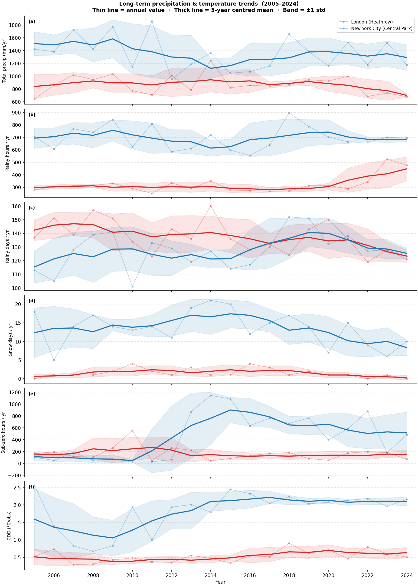

# lon_nyc
[](https://github.com/sdat2/lon_nyc/actions/workflows/ci.yml)

Is New York City wetter than London?  The popular image of London as a drizzly,
rain-soaked city persists despite evidence to the contrary.  This project
compares hourly precipitation and temperature records for both cities using the
[NOAA Integrated Surface Database (ISD)](https://www.ncei.noaa.gov/products/land-based-station/integrated-surface-database)
hosted on the public AWS S3 bucket `noaa-global-hourly-pds`.

**The answer is unambiguous: NYC is substantially wetter and more climatically
extreme than London.**  Across 2015–2024, NYC received **~55 % more rainfall
by volume** (avg ~1290 mm/yr vs ~840 mm/yr) and logged roughly **690 rainy
hours/year versus ~335 for London**, at every precipitation threshold from 0.01
to 5 mm.  London logs more rainy *days* at low thresholds (its FM-12 reports
capture many sub-mm drizzle events), but NYC takes over above ~1 mm — and
leads overwhelmingly on volume and hours.  On temperature the cities have a
similar heating burden (HDD ~4–5 °C/obs each), but NYC's summers are far
hotter — cooling degree-days run **3–4× higher** every single year — and its
winters are genuinely cold, with **400–1100 sub-freezing hours/year versus London's 75–200**.
London's "drizzly" reputation is a perception artefact
driven by frequent sub-trace overcast events that account for negligible
rainfall volume.

## Results (2015–2024)

> **NYC leads on total rainfall and rainy hours every year.** On rainy *days*,
> London leads in 5 of 10 years at the standard 0.254 mm threshold — consistent
> with its many low-intensity events — though NYC takes over as the threshold
> rises above ~1 mm.

Annual totals for 2015–2024 (2025 excluded as a partial year):

| Year | City | Total (mm) | Rainy hours | Rainy days |
|------|------|----------:|------------:|-----------:|
| 2015 | London (Heathrow) | 820 | 278 | **136** |
| 2015 | New York City (Central Park) | **1049** | **599** | 114 |
| 2016 | London (Heathrow) | 856 | 273 | **128** |
| 2016 | New York City (Central Park) | **1071** | **556** | 117 |
| 2017 | London (Heathrow) | 846 | 268 | **132** |
| 2017 | New York City (Central Park) | **1158** | **639** | 130 |
| 2018 | London (Heathrow) | 868 | 270 | 124 |
| 2018 | New York City (Central Park) | **1658** | **896** | **152** |
| 2019 | London (Heathrow) | 945 | 313 | 143 |
| 2019 | New York City (Central Park) | **1392** | **796** | **153** |
| 2020 | London (Heathrow) | 924 | 314 | **150** |
| 2020 | New York City (Central Park) | **1166** | **705** | 132 |
| 2021 | London (Heathrow) | 998 | 288 | 136 |
| 2021 | New York City (Central Park) | **1527** | **666** | **138** |
| 2022 | London (Heathrow) | 684 | 342 | 119 |
| 2022 | New York City (Central Park) | **1186** | **668** | **127** |
| 2023 | London (Heathrow) | 737 | 526 | 128 |
| 2023 | New York City (Central Park) | **1523** | **703** | 128 |
| 2024 | London (Heathrow) | 680 | 477 | **123** |
| 2024 | New York City (Central Park) | **1178** | **698** | 121 |

A "rainy hour or rainy day" uses the standard WMO threshold of **> 0.254 mm
(0.01 inch)** of liquid-equivalent precipitation.

**NYC leads on total rainfall and rainy hours across all ten years** — more
total rainfall and more rainy hours every single year.  On rainy days London
leads slightly at the standard 0.254 mm threshold (see the threshold
sensitivity plot below).  London's high day counts come from frequent
low-intensity events (< 0.254 mm) that account for negligible volume.

The figure below sweeps the threshold continuously (log scale, 0.01–5 mm) to
confirm that NYC's dominance on total volume and rainy hours is real.  The
rainy-days panel tells a more nuanced story: London leads at every threshold
below ~1 mm (its many low-intensity events accumulate into more measurable
days), NYC takes over above ~1 mm where individual event intensity matters
more, with a brief London resurgence around 1.5 mm before NYC pulls clear.


## Long-term trends (2005–2024)

NYC Central Park station data is available in the NOAA ISD from 2005 onwards
(earlier years exist in the archive but use a different report-type label —
`AUTO` rather than `FM-15` — and were excluded from the 2015–2024 summaries
above; they are included here after verification that the data are consistent).
The figure below shows six annual metrics on a shared year axis.  Each city's
annual value is plotted as a semi-transparent line with dots; the thick line is
a 5-year centred rolling mean (±1 std shaded) to reveal any secular drift.



**Observations from the 20-year record:**

* **No significant trend in total precipitation for either city.**  Both
  London's and NYC's rolling means are essentially flat across 2005–2024,
  with large year-to-year variability swamping any signal.  NYC's mean sits
  ~400–600 mm above London's throughout the entire period.
* **NYC rainy-hours count is higher every single year** and shows no
  narrowing of the gap over time.  London's count has drifted upward since
  ~2020 (driven by the switch to higher-frequency FM-15 supplemental
  reporting at Heathrow) — this is a **data artefact**, not a real
  climate signal; the total precipitation (panel a) shows no corresponding
  increase.
* **Snow days (panel d) confirm no long-term trend** in either city.
  NYC averages 12–15 snow days/yr in the 2000s and 2010s, dipping to 6–10
  in the early 2020s; London's record remains flat at 0–4 days throughout.
* **Sub-zero hours (panel e) show NYC becoming slightly milder** over the
  period — the 5-year mean fell from ~700–1100 hrs/yr in 2005–2015 to
  ~400–600 hrs/yr in 2020–2024 — consistent with the broader US trend of
  warming winters.  London's sub-zero hours are stable at 50–250 hrs/yr.
* **CDD (panel f) is rising for both cities**, most visibly for London where
  the rolling mean has climbed from ~0.3 to ~0.7 °C/obs over the 20 years,
  consistent with European summer warming trends.  NYC's CDD is higher and
  noisier but also trends upward from ~1.0–1.5 to ~2.0–2.5 °C/obs.

## Snow vs liquid rain (2015–2024)

The `AA1` precipitation field records **liquid-water equivalent** for all
precipitation phases, so rain and snow both contribute to the depth column.
Snow and frozen-precipitation events are identified separately from the ISD
`AW1`/`AW2`/`AW3` automated present-weather fields: any hour carrying a
condition code in the range 70–79 (continuous or intermittent snow, ice
pellets, diamond dust) or 83–89 (snow showers, mixed rain/snow, soft hail) is
flagged as a **snow hour**.  A snow hour must also clear the 0.254 mm
measurable-precipitation threshold to be counted.  A calendar day is a **snow
day** if it contains at least one snow hour; a **liquid-rain day** if it
contains liquid-rain hours *and no snow hours at all* (so mixed days are
counted only in snow days).

| Year | City | Rainy days | Snow days | Liquid-rain days | Snow hours | Liquid-rain hours |
|------|------|----------:|----------:|-----------------:|-----------:|------------------:|
| 2015 | London (Heathrow) | 136 | 1 | 135 | 1 | 277 |
| 2015 | New York City (Central Park) | 114 | **20** | 94 | **93** | 506 |
| 2016 | London (Heathrow) | 128 | 4 | 124 | 4 | 269 |
| 2016 | New York City (Central Park) | 117 | **12** | 105 | **65** | 491 |
| 2017 | London (Heathrow) | 132 | 3 | 129 | 3 | 265 |
| 2017 | New York City (Central Park) | 130 | **15** | 115 | **76** | 563 |
| 2018 | London (Heathrow) | 124 | 1 | 123 | 1 | 269 |
| 2018 | New York City (Central Park) | 152 | **17** | 135 | **90** | 806 |
| 2019 | London (Heathrow) | 143 | 2 | 141 | 2 | 311 |
| 2019 | New York City (Central Park) | 153 | **14** | 139 | **62** | 734 |
| 2020 | London (Heathrow) | 150 | 1 | 149 | 1 | 313 |
| 2020 | New York City (Central Park) | 132 | **7** | 125 | **31** | 674 |
| 2021 | London (Heathrow) | 136 | 1 | 135 | 1 | 287 |
| 2021 | New York City (Central Park) | 138 | **15** | 123 | **75** | 591 |
| 2022 | London (Heathrow) | 119 | 0 | 119 | 0 | 342 |
| 2022 | New York City (Central Park) | 127 | **9** | 118 | **59** | 609 |
| 2023 | London (Heathrow) | 128 | 1 | 127 | 1 | 525 |
| 2023 | New York City (Central Park) | 128 | **6** | 122 | **18** | 685 |
| 2024 | London (Heathrow) | 123 | 0 | 123 | 0 | 477 |
| 2024 | New York City (Central Park) | 121 | **10** | 111 | **50** | 648 |
| **Mean** | **London (Heathrow)** | **132** | **1.4** | **130.5** | **1** | **334** |
| **Mean** | **New York City (Central Park)** | **131** | **12.5** | **118.7** | **62** | **631** |

**Key findings:**

* **NYC gets roughly 9× more snow days than London** (avg 12.5 vs 1.4/yr).
  London's two snowiest years in this period were 2016 and 2017 (4 and 3 snow
  days respectively); NYC's quietest was 2023 (6 days, a very mild winter).
* **Snow hours are ~60× more frequent in NYC** (avg 62 vs 1 hr/yr).  The
  large ratio relative to snow days reflects NYC's heavier snowfall events —
  a single nor'easter (e.g. Blizzard Jonas January 2016, Winter Storm Stella
  March 2017) can account for 20–40 snow hours in a single multi-day event.
* **London gets more liquid-rain days than NYC** when snow days are set aside
  (avg 130.5 vs 118.7/yr), consistent with its higher frequency of
  low-intensity drizzle events noted in the precipitation section above.
* **NYC's liquid-rain hours still far exceed London's** (avg 631 vs 334/yr),
  confirming that NYC's dominance in total hourly precipitation is driven by
  liquid rain, not snow.
* London had **zero measurable snow hours** in both 2022 and 2024 — years that
  did not produce a single AW1-coded frozen-precipitation event above the
  0.254 mm threshold at Heathrow.

## Temperature (2015–2024)

Temperature is taken from the ISD `TMP` field (see [Methodology](#methodology)).
All metrics are normalised by observation count so that the two stations'
different reporting densities (London ≈ 24 obs/day on FM-12, NYC ≈ 12–18 on
FM-15) do not distort the comparison.

| Year | City | HDD (°C/obs) | CDD (°C/obs) | Comfort dev (°C) | <0 °C hours |
|------|------|-------------:|-------------:|---------------------:|------------:|
| 2015 | London (Heathrow) | 4.42 | 0.34 | 9.35 | 85 |
| 2015 | New York City (Central Park) | **5.43** | **2.44** | **10.15** | **1085** |
| 2016 | London (Heathrow) | 4.90 | 0.54 | 9.70 | 128 |
| 2016 | New York City (Central Park) | **5.01** | **2.32** | **9.77** | **638** |
| 2017 | London (Heathrow) | 4.59 | 0.52 | 9.42 | 170 |
| 2017 | New York City (Central Park) | **5.16** | **2.04** | **9.69** | **761** |
| 2018 | London (Heathrow) | 4.80 | 0.90 | 9.55 | 183 |
| 2018 | New York City (Central Park) | **5.63** | **2.24** | **10.30** | **676** |
| 2019 | London (Heathrow) | 4.72 | 0.62 | 9.54 | 82 |
| 2019 | New York City (Central Park) | **5.48** | **2.03** | **10.09** | **764** |
| 2020 | London (Heathrow) | 4.50 | 0.71 | 9.33 | 54 |
| 2020 | New York City (Central Park) | 4.69 | **2.07** | 9.35 | **401** |
| 2021 | London (Heathrow) | **5.02** | 0.47 | **9.89** | 175 |
| 2021 | New York City (Central Park) | 4.93 | **2.13** | 9.47 | **584** |
| 2022 | London (Heathrow) | 4.33 | 0.80 | 9.09 | 199 |
| 2022 | New York City (Central Park) | **5.29** | **2.18** | **9.98** | **879** |
| 2023 | London (Heathrow) | **4.46** | 0.60 | **9.20** | **181** |
| 2023 | New York City (Central Park) | 4.23 | **1.96** | 8.78 | 179 |
| 2024 | London (Heathrow) | 4.07 | 0.51 | 8.85 | 74 |
| 2024 | New York City (Central Park) | **4.57** | **2.15** | **9.10** | **484** |

* **HDD** = mean °C below 15.5 °C per observation (heating pressure).
  Both cities are roughly equal — London is slightly colder most years but the
  gap is small (< 1 °C/obs).
* **CDD** = mean °C above 18 °C per observation (cooling pressure).
  NYC runs **3–4× higher** than London every single year.  NYC summers are
  genuinely hot; London rarely sustains temperatures above 18 °C for long.
* **< 0 °C hours** makes NYC's cold winters visible.  NYC regularly freezes for
  400–1100 hours a year; London typically logs 75–200.  The HDD metric alone
  understated this because NYC's hot summers partially cancel its winter cold
  when averaged over the full year.

The figure below shows the full hourly temperature distributions alongside the
mean absolute deviation from any chosen reference temperature.  London's
histogram is narrowly Gaussian around 10–11 °C; NYC's is flatter and wider,
and its deviation curve sits higher across the board — reflecting a more
continental climate with hotter summers and colder winters.


### Why the stereotype persists

London has noticeably more *overcast, grey* days than NYC.  When a looser
threshold (any non-zero AA1 depth) is applied, London scores more rainy days
(154–184 vs 121–138) because its FM-12 SYNOP reports frequently log sub-trace
accumulations of 0.1–0.2 mm drizzle.  NYC's METAR observations encode
equivalent events as `condition=2` (trace) with `depth=0`, which disappears
under any positive threshold.  The 0.254 mm threshold eliminates this
reporting asymmetry.

## Installation

Requires Python ≥ 3.9.

```bash
python -m venv .venv
source .venv/bin/activate
pip install -e .
```

## Usage

```bash
python -m lon_nyc [--start YEAR] [--end YEAR] [--plot FILE] [--temp-plot FILE] [--snow-plot FILE] [--trend-plot FILE]
```

Or, if installed via `pip install -e .`:

```bash
lon-nyc [--start YEAR] [--end YEAR] [--plot FILE] [--temp-plot FILE] [--snow-plot FILE] [--trend-plot FILE]
```

| Argument | Default | Description |
|----------|---------|-------------|
| `--start` | `2020` | First year to fetch (inclusive) |
| `--end`   | `2025` | Last year to fetch (inclusive) |
| `--plot FILE` | *(none)* | Save a rainfall threshold-sensitivity plot to *FILE* (PNG) |
| `--temp-plot FILE` | *(none)* | Save a temperature histogram + deviation plot to *FILE* (PNG) |
| `--snow-plot FILE` | *(none)* | Save a snow vs liquid-rain 2×2 stacked-bar figure to *FILE* (PNG) |
| `--trend-plot FILE` | *(none)* | Save a multi-panel long-term trends figure (5-yr rolling mean) to *FILE* (PNG) |
| `--no-cache` | *(off)* | Disable on-disk CSV cache (re-downloads from S3) |

## Example

```bash
python -m lon_nyc --start 2005 --end 2024 \
    --plot plots/threshold_sensitivity.png \
    --temp-plot plots/temperature_panels.png \
    --snow-plot plots/snow_vs_rain.png \
    --trend-plot plots/long_term_trends.png
```

Sample output:

```
================================Annual Precipitation Summary================================
Years 2005–2024 | threshold: >0.254 mm

Year   City                             Total (mm)  Rainy hrs  Rainy days  Snow hrs  Snow days  Rain hrs  Rain days
--------------------------------------------------------------------------------------------------------------------
2005   London (Heathrow)                     641.2        278         137         0          0       278        137
2005   New York City (Central Park)         1422.8        706         113        74         18       632         95
...

==============================Annual Temperature Summary==============================
Years 2015–2024 | HDD base: 15.5°C  CDD base: 18.0°C  Comfort base: 21.0°C

Year   City                              HDD (°C/obs)  CDD (°C/obs)  Comfort dev  <0°C hrs
-------------------------------------------------------------------------------------------
2015   London (Heathrow)                         4.42          0.34         9.35        85
2015   New York City (Central Park)              5.43          2.44        10.15      1085
...
```

## Methodology

### Stations

| City | Station | USAF | WBAN | WMO | Report type |
|------|---------|------|------|-----|-------------|
| New York City (Central Park) | `725053-94728` | 725053 | 94728 | — | FM-15 (METAR) |
| London (Heathrow, EGLL) | `037720-99999` | 037720 | 99999* | 03772 | FM-12 (SYNOP) |

\* UK stations have no WBAN code; `99999` is the standard ISD placeholder.

S3 object keys strip the hyphen from the station ID, e.g.
`noaa-global-hourly-pds/2023/72505394728.csv`.

### Precipitation field

Precipitation depth is taken from the ISD `AA1` compound field:

```
AA1 = period_hours , depth_tenths_mm , condition_code , quality_code
```

The **depth** (second sub-field, index 1) is an integer in tenths of
millimetres, converted to mm by dividing by 10.  Missing observations are
coded `9999` or `+9999` and become `NaN`.

`AA1` always reports **liquid-water equivalent** regardless of precipitation
phase, so rain, snow, sleet, and freezing rain all contribute to the same
depth column.  Snow and frozen events appear as positive depths in `AA1` at the
same liquid-equivalent rate — there is no snow/rain asymmetry between the two
cities in the depth field.

### Snow / frozen-precipitation detection

Precipitation phase is determined from the ISD automated present-weather fields
`AW1`, `AW2`, and `AW3`.  Each field encodes a single weather phenomenon as
`condition_code,quality_code`.  An observation hour is flagged as **frozen
precipitation** when any of the available `AWn` columns carries a code from the
following ranges (ISD Section 7.1):

| Code range | Phenomenon |
|-----------|-----------|
| 70–75 | Continuous or intermittent snow (light → heavy) |
| 76–79 | Diamond dust, snow grains, ice crystals, ice pellets (sleet) |
| 83–84 | Moderate/heavy shower of mixed rain and snow |
| 85–86 | Light or moderate/heavy snow showers |
| 87–89 | Soft hail, ice pellet showers, small hail |

A row is a **snow hour** only when it also clears the 0.254 mm measurable-
precipitation threshold.  A day is a **snow day** if it contains at least one
snow hour; a **liquid-rain day** if it has liquid-rain hours *and no snow hours
at all* (mixed days are classified as snow days only).


| Code | Name | Kept? | Reason |
|------|------|-------|--------|
| FM-15 | METAR (hourly) | ✅ | Primary NYC observation type; also present at Heathrow but used only as a fallback (see note below) |
| FM-12 | SYNOP (hourly) | ✅ | Primary London/Heathrow observation type |
| FM-16 | SPECI (special METAR) | ❌ | Sub-hourly; variable AA1 period causes double-counting |
| SOD/SOM | Daily/monthly summaries | ❌ | Not hourly |

> **Heathrow FM-12 vs FM-15 for temperature.**  Heathrow files both FM-12
> (SYNOP) and FM-15 (METAR) reports, but the ISD stores temperature in the
> FM-15 rows at **whole-degree Celsius** resolution only (e.g. `+0100` = 10 °C
> exactly), whereas FM-12 rows carry genuine **0.1 °C** resolution.  Using
> FM-15 rows would produce large artificial spikes at every integer °C in the
> temperature histogram.  The processor therefore uses FM-12 rows exclusively
> for temperature whenever a station files any FM-12 reports, falling back to
> FM-15 only for stations (like NYC) that have no FM-12 data at all.  This is
> done automatically — no station-specific configuration is needed.
> For **precipitation**, FM-12 rows are used for Heathrow because the `AA1`
> accumulation field is only populated there on FM-12 rows; NYC's `AA1` data
> is on FM-15 rows.  Both types are parsed and the results combined.

### Rainy-hour threshold

An hour is counted as **rainy** when `precipitation_mm > 0.254 mm`
(equivalent to the US NWS / WMO definition of 0.01 inch of measurable
precipitation).

Using `> 0 mm` instead inflates London's counts because Heathrow's FM-12
SYNOP reports frequently log sub-trace accumulations (0.1–0.2 mm drizzle)
that NYC's FM-15 METARs encode as `condition=2` / `depth=0` (trace).
The 0.254 mm threshold eliminates this reporting asymmetry and aligns both
cities with published climate-table conventions.

### Rainy-day definition

A calendar day is **rainy** if it contains at least one rainy hour (i.e.
at least one hour with liquid-equivalent depth > 0.254 mm).  Rainy days
decompose into **snow days** (at least one snow hour that day) and **liquid-rain
days** (one or more liquid-rain hours, no snow hours); the two categories are
mutually exclusive so they sum to the total rainy-day count.

### Temperature discomfort

Hourly air temperature is taken from the ISD `TMP` mandatory field:

```
TMP = +TTTT , Q
```

`TTTT` is temperature in **tenths of °C** (signed integer); `Q` is a quality
flag.  Two categories of observation are excluded as `NaN`:

* **Missing sentinel** — `+9999` / `9999`.
* **Bad quality flags** — codes `2` (suspect), `3` (erroneous), `6` (suspect
  by element-consistency check), `7` (erroneous by element-consistency check),
  and `9` (missing).  Codes `0`, `1`, `4`, `5` are accepted.

As noted in the report-type section above, Heathrow FM-12 rows are used
exclusively for temperature (0.1 °C resolution); FM-15 rows are dropped for
this station to avoid whole-degree histogram spikes.

Three metrics are computed, each using its own conventional baseline, and all
normalised by observation count to make the two stations comparable:

| Metric | Formula | Baseline | Standard |
|--------|---------|----------|---------|
| **HDD** | mean(max(15.5 − T, 0)) | 15.5 °C | WMO / UK Met Office heating degree-day base |
| **CDD** | mean(max(T − 18, 0)) | 18.0 °C | Standard cooling degree-day base |
| **Comfort dev** | mean(\|T − 21\|) | 21.0 °C | Two-sided deviation from a comfortable temperature |
| **< 0 °C hours** | count(T < 0) | 0 °C | Raw count of freezing hours per year |

Using separate baselines for HDD and CDD (rather than one combined baseline)
ensures each metric measures what it is conventionally understood to measure.

## Validation against GHCND (NYC)

Annual totals from the ISD `AA1` field were cross-checked against
[GHCND](https://www.ncei.noaa.gov/products/land-based-station/global-historical-climatology-network-daily)
daily totals for Central Park (station `USW00094728`).
Agreement is within ~1% across all years.

| Year | GHCND official | Our ISD calc | Difference |
|------|---------------:|-------------:|-----------:|
| 2020 | 1151.9 mm (45.35 in) | 1166.0 mm | +1.2% |
| 2021 | 1517.1 mm (59.73 in) | 1527.3 mm | +0.7% |
| 2022 | 1176.0 mm (46.30 in) | 1185.7 mm | +0.8% |
| 2023 | 1506.0 mm (59.29 in) | 1523.3 mm | +1.2% |
| 2024 | 1177.8 mm (46.37 in) | 1178.0 mm | +0.0% |

The small systematic ~+1% occurs because GHCND records trace (`T`)
precipitation as exactly zero, whereas the ISD `AA1` field sometimes
encodes a small positive depth for the same events.

## Running the tests

```bash
pip install -e ".[dev]"
pytest
```

## Planned: sunshine hours comparison

The natural follow-up question is whether London has more sunshine than NYC —
the other half of the "miserable London weather" stereotype.

### London
Real observed hourly sunshine data (Campbell-Stokes recorder) is available
from the **Met Office MIDAS Open** dataset via
[CEDA](https://dap.ceda.ac.uk/badc/ukmo-midas-open/data/uk-hourly-weather-obs/):
- Station: Heathrow (`src_id` 708), field `sun_dur_mins`
- Authentication: free CEDA account → bearer token via
  `POST https://services.ceda.ac.uk/api/token/create/`

### NYC
No equivalent observed sunshine record exists in any public US network.  The
following sources were investigated:

| Source | Outcome |
|--------|---------|
| GHCND `TSUN` — Central Park, JFK, LaGuardia | 0 / 365 days populated in 2020–2024 |
| NOAA LCD `HourlySkyConditions` | Cloud-layer codes only; no duration |
| ISD `GF1` sky-cover oktas | Invalid proxy — counts night-time clear sky |
| ISD `REM` `55SSS` SYNOP groups — Central Park / JFK / LaGuardia | Sparse and unreliable |
| ISD `REM` `55SSS` SYNOP groups — **Newark EWR** (`725020-14734`) | Investigated in detail below; not usable |
| NOAA SURFRAD / SolRad-Net pyranometer networks | Nearest station is Penn State, PA (≈ 250 km); no NYC-area site |
| NOAA US Climate Reference Network (USCRN) | No station within NYC or close suburbs |
| NASA AERONET — CCNY (`40.82°N, 73.95°W`) and GISS (`40.80°N, 73.96°W`) | Cimel direct-sun photometers only observe when the sun is unobscured, so obs presence ≠ cloud-free sky; additionally Level 1.5 data are cloud-screened (cloudy obs removed), gaps cannot be distinguished from instrument downtime (e.g. a 6-day outage Jun 18–24 2023), and the SZA cutoff (≈ 78°) causes systematic undercounting of ~2–3 h/day near sunrise/sunset |
| NOAA 1961–1990 climate normals (`TSUN`) — Central Park | Monthly normals exist (≈ 2 535 hrs/yr) but the underlying sunshine recorder was discontinued; no equivalent hourly series for 2020–2024 |
| Open-Meteo ERA5 reanalysis | Modelled, not observed; inflates ≈ 60 % vs Met Office actuals |

#### Newark EWR investigation

Newark Liberty International Airport (`725020-14734`) is the closest major
weather station to NYC that files SYNOP (FM-12) reports in the ISD, and was
investigated as a possible sunshine-recorder proxy.  The ISD `REM` field was
parsed for WMO SYNOP `55SSS` groups (sunshine duration in tenths of hours since
the last observation) across 2020–2024, excluding sentinel values ≥ 300.

| Year | Newark SYN rows | Real `55SSS` obs | Implied sunshine hrs | Avg hr/day |
|------|----------------:|-----------------:|---------------------:|-----------:|
| 2020 | 1 450 | 96 | 51 | 0.1 |
| 2021 | 1 436 | 89 | 39 | 0.1 |
| 2022 | 1 449 | 101 | 44 | 0.1 |
| 2023 | 1 655 | 102 | 46 | 0.1 |
| 2024 | 2 775 | 219 | 101 | 0.3 |

For comparison, Heathrow logs 634–941 real `55SSS` observations per year and
implies 1 250–1 680 sunshine hours annually (≈ 3.4–4.6 hr/day) — physically
plausible for a Campbell-Stokes recorder.  Newark's implied totals of
39–101 hours per year (≈ 0.1 hr/day) are physically impossible and confirm
that **Newark does not operate a sunshine-duration recorder**.  The sparse
`55SSS` groups that do appear are opportunistic entries in manually augmented
SYNOP messages, not systematic instrument readings.

**Conclusion:** No observed sunshine-duration series for NYC is available for
2020–2024 in any public network.  US ASOS/AWOS stations do not deploy
sunshine-duration recorders, and the radiation monitoring networks (SURFRAD,
SolRad-Net, USCRN) have no NYC-area site.  The AERONET instruments at CCNY and
GISS are in principle a sunshine proxy (they only observe when the sun is
unobscured) but are not usable in practice: the Level 1.5 cloud-screened
dataset removes cloudy observations, making gaps indistinguishable from
instrument downtime (a 6-day outage was confirmed in June 2023), and the solar
zenith angle cutoff (≈ 78°) causes systematic undercounting of 2–3 hours of
daylight near sunrise and sunset.  Historical NOAA normals show ≈ 2 535
sunshine hours/yr for Central Park in the 1961–1990 period, but the underlying
instrument record has not been continued.  Implementation is deferred until an
equivalent NYC observed-sunshine source is identified.

### Wikipedia climate-normal comparison

Even though a contemporary observed series for NYC is unavailable, the
Wikipedia long-term normals allow a static city-to-city comparison.  The
Heathrow 2015–2024 observed mean (derived from ISD `55SSS` groups, see
`scripts/heathrow_sunshine.py`) can be compared against both its own
1991–2020 Met Office normal and the NOAA 1961–1990 Central Park normal.

| Month | LHR obs 2015–24 (h) | LHR wiki 1991–2020 (h) | NYC wiki 1961–90 (h) | NYC − LHR (h) |
|-------|--------------------:|-----------------------:|---------------------:|--------------:|
| Jan   |  72.0 | 57.5  | 162.7 | +105.2 |
| Feb   |  82.5 | 77.8  | 163.1 |  +85.3 |
| Mar   | 112.0 | 111.5 | 212.5 | +100.5 |
| Apr   | 158.3 | 157.3 | 225.6 |  +67.3 |
| May   | 180.8 | 192.0 | 256.6 |  +75.8 |
| Jun   | 187.4 | 196.4 | 257.3 |  +69.9 |
| Jul   | 185.3 | 203.3 | 268.2 |  +82.9 |
| Aug   | 162.9 | 196.8 | 268.2 | +105.3 |
| Sep   | 130.4 | 144.7 | 219.3 |  +88.9 |
| Oct   |  99.7 | 100.9 | 211.2 | +111.5 |
| Nov   |  71.5 |  62.8 | 151.0 |  +79.5 |
| Dec   |  57.4 |  44.6 | 139.0 |  +81.6 |
| **Annual** | **1 500** | **1 546** | **2 535** | **+989** |

Sources: NYC — NOAA 1961–1990 normals via
[Wikipedia](https://en.wikipedia.org/wiki/Climate_of_New_York_City).
LHR wiki — Met Office 1991–2020 normals via
[Wikipedia](https://en.wikipedia.org/wiki/London_Heathrow_Airport#Climate).
LHR obs — computed from NOAA ISD `55SSS` groups (this project,
`scripts/heathrow_sunshine.py`).

**Key finding:** NYC receives roughly **+990 hours more sunshine per year**
than London Heathrow — about **64 % more** (2 535 h vs 1 546 h).  The gap is
largest in autumn and winter (Oct +112 h, Jan +105 h, Aug +105 h) and
smallest in late spring/early summer (Apr +67 h, Jun +70 h), when London's
long days partially compensate for its cloudier skies.  The Heathrow
2015–2024 observed mean (1 500 h) is close to the 1991–2020 normal (1 546 h),
giving confidence that the ISD-derived series is well-calibrated.

Note: the baseline periods differ (1961–1990 for NYC, 1991–2020 for LHR), so
the comparison is indicative rather than strictly contemporaneous.

## Daylight seasonality: latitude effect on usable daylight

### Motivation

London sits at **51.5°N** and New York City at **40.7°N** — a difference of
nearly 11 degrees of latitude.  That gap drives a dramatic difference in day
length seasonality.  London's summer days are very long (≈ 16.4 h near the
June solstice) while its winter days are very short (≈ 7.6 h near the December
solstice).  NYC is more moderate in both directions (≈ 14.9 h in June,
≈ 9.1 h in December).

The key question is: **how much of that daylight is actually usable**, given
that early-morning light before you wake up and late-evening light after
bedtime is largely wasted?

### Method

The analysis uses the standard WMO sunrise equation (see
`scripts/daylight_latitude.py`):

```
δ = −23.45° × cos(360/365 × (doy + 10))
cos(ω₀) = −tan(φ) × tan(δ)
day_length = 2ω₀ / 15   (hours)
```

where *doy* is day-of-year and *φ* is latitude.  Sunrise and sunset are
expressed in local solar time, which is a good proxy for clock time at these
longitudes (London ≈ 0°W, NYC ≈ 74°W with UTC−5 standard time).  Daylight
Saving Time is not applied; DST shifts both cities' clocks equally.

**Usable daylight** is the overlap of [sunrise, sunset] with the waking
window, averaged over all 365 days of the year.

### Effect of sleep schedule

Rather than fix a single waking window, `scripts/sleep_schedule_daylight.py`
sweeps the **wake-up time** across the full 24-hour clock in 15-minute steps,
assuming a fixed **8-hour sleep window** (so 16 waking hours).  For each
wake-up time, usable daylight is the overlap of the 16-hour waking window with
[sunrise, sunset], averaged over all 365 days.

**London (red) vs NYC (blue) — annual-mean usable daylight by wake-up time:**


### Key findings

1. **For typical sleep schedules (wake 06:00–12:00), the difference is negligible.**
   NYC leads by at most ~0.2 h/day — barely 12 minutes.
   Waking anywhere between 08:00 and noon gives almost identical usable
   daylight in both cities.

2. **Early risers get slightly more in NYC.**  London's extreme winter
   shortfall (December days of only 7.7 h) is not compensated by its long
   summer mornings, which mostly fall before any reasonable wake time.
   NYC's more moderate year-round day length gives it a small consistent edge
   for normal schedules.

3. **Night owls get more daylight in London.**  For wake times of roughly
   **12:00–20:00** (sleeping through the morning), London's very long summer
   evenings pay off.  The London advantage peaks at **+0.22 h/day when waking
   at 14:00** — the only scenario where London's latitude is genuinely
   beneficial for usable daylight.

4. **London's daylight is 1.5× more seasonal.**  The standard deviation of
   daily day length is 3.0 h/day in London vs 2.0 h/day in NYC.  London's
   extreme seasonality amplifies both directions, but the waking-window clips
   only the top (early-morning summer hours), not the bottom (short winter
   days) — producing a net annual deficit for most schedules.

Scripts: `scripts/daylight_latitude.py` and `scripts/sleep_schedule_daylight.py`
(no external data required — purely astronomical).
