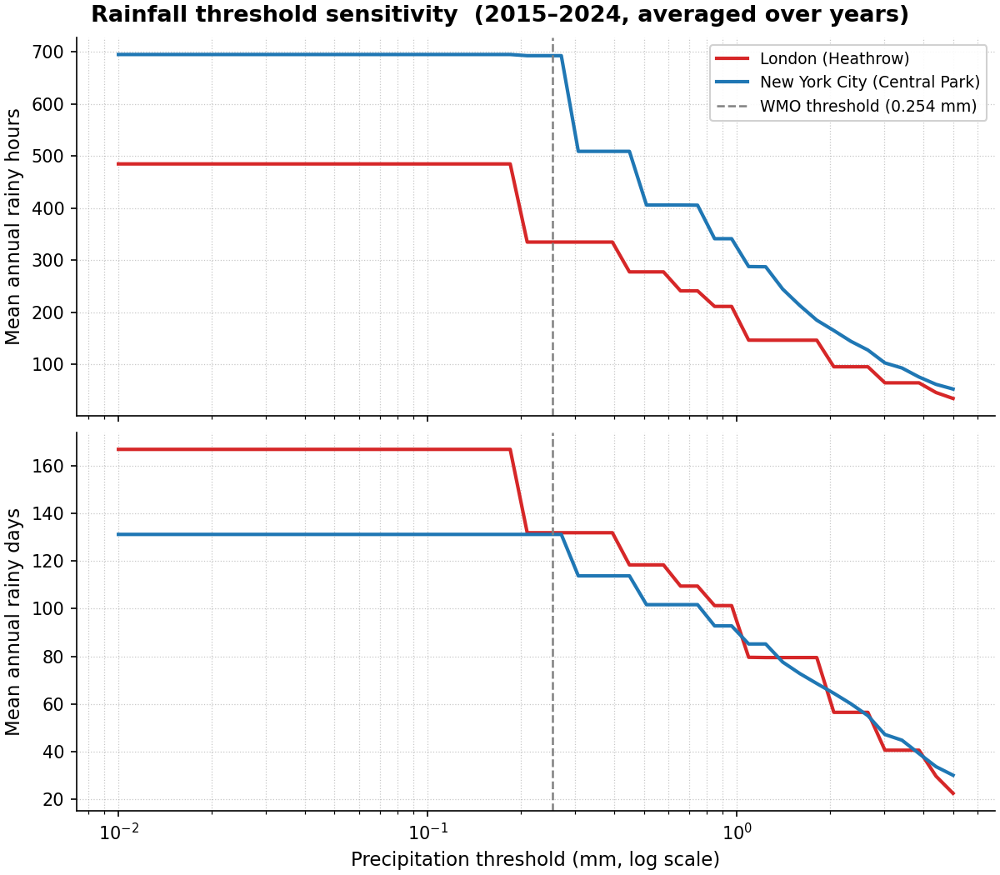
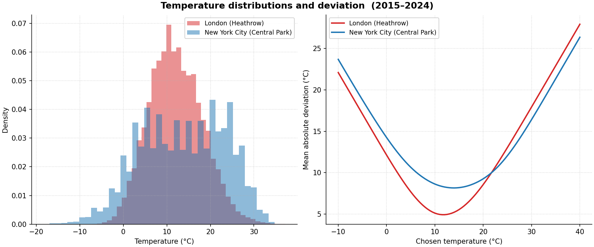
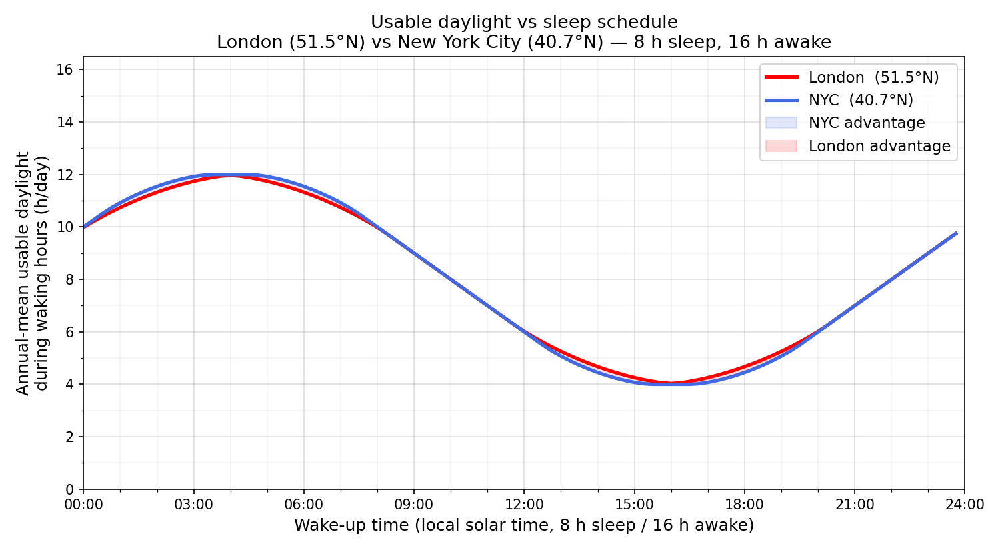

# lon.nyc

Is New York City wetter than London?  The popular image of London as a drizzly,
rain-soaked city persists despite evidence to the contrary.  This project
compares hourly precipitation and temperature records for both cities using the
[NOAA Integrated Surface Database (ISD)](https://www.ncei.noaa.gov/products/land-based-station/integrated-surface-database)
hosted on the public AWS S3 bucket `noaa-global-hourly-pds`.

**The answer is unambiguous: NYC is substantially wetter and more climatically
extreme than London.**  Across 2020–2024, NYC received **60–70 % more rainfall
by volume** (avg ~1320 mm/yr vs ~805 mm/yr) and logged roughly **690 rainy
hours/year versus ~390 for London**, at every precipitation threshold from 0.01
to 5 mm.  On temperature the cities have a similar heating burden (HDD
~4–5 °C/obs each), but NYC's summers are far hotter — cooling degree-days run
**3–4× higher** every single year — and its winters are genuinely cold, with
**400–900 sub-freezing hours/year versus London's 100–500**.  London's
"drizzly" reputation is a perception artefact driven by frequent sub-trace
overcast events that do not register as measurable precipitation.

## Results (2020–2024)

> **NYC leads on every dimension.** More total rainfall, more rainy hours, and
> comparable or greater numbers of rainy days across all five years — robust to
> any choice of measurement threshold.

Annual totals for 2020–2024 (2025 excluded as a partial year):

| Year | City | Total (mm) | Rainy hours | Rainy days |
|------|------|----------:|------------:|-----------:|
| 2020 | London (Heathrow) | 924 | 314 | 150 |
| 2020 | New York City (Central Park) | **1166** | **705** | 132 |
| 2021 | London (Heathrow) | 998 | 288 | 136 |
| 2021 | New York City (Central Park) | **1527** | **666** | **138** |
| 2022 | London (Heathrow) | 684 | 342 | 119 |
| 2022 | New York City (Central Park) | **1186** | **668** | **127** |
| 2023 | London (Heathrow) | 737 | 526 | 128 |
| 2023 | New York City (Central Park) | **1523** | **703** | **128** |
| 2024 | London (Heathrow) | 680 | 477 | 123 |
| 2024 | New York City (Central Park) | **1178** | **698** | **121** |

A "rainy hour / day" uses the standard WMO threshold of **> 0.254 mm
(0.01 inch)** of liquid-equivalent precipitation.

**NYC leads on every dimension across all five years** — more total rainfall,
more rainy hours, and comparable or greater numbers of rainy days.  London's
"drizzly" reputation comes from frequent low-intensity events (< 0.254 mm)
that do not register as measurable precipitation under the standard definition.

## Temperature (2020–2024)

Temperature is taken from the ISD `TMP` field (see [Methodology](#methodology)).
All metrics are normalised by observation count so that the two stations'
different reporting densities (London ≈ 24 obs/day on FM-12, NYC ≈ 12–18 on
FM-15) do not distort the comparison.

| Year | City | HDD (°C/obs) | CDD (°C/obs) | Comfort dev (°C) | <0 °C hours |
|------|------|-------------:|-------------:|---------------------:|------------:|
| 2020 | London (Heathrow) | 4.50 | 0.68 | 9.33 | 104 |
| 2020 | New York City (Central Park) | 4.69 | **2.07** | 9.35 | **401** |
| 2021 | London (Heathrow) | **4.99** | 0.44 | **9.84** | 434 |
| 2021 | New York City (Central Park) | 4.93 | **2.13** | 9.47 | **584** |
| 2022 | London (Heathrow) | 4.32 | 0.79 | 9.07 | 501 |
| 2022 | New York City (Central Park) | **5.29** | **2.18** | **9.98** | **879** |
| 2023 | London (Heathrow) | **4.44** | 0.60 | **9.18** | **462** |
| 2023 | New York City (Central Park) | 4.23 | **1.96** | 8.79 | 179 |
| 2024 | London (Heathrow) | 4.17 | 0.48 | 8.97 | 199 |
| 2024 | New York City (Central Park) | **4.57** | **2.15** | **9.10** | **486** |

* **HDD** = mean °C below 15.5 °C per observation (heating pressure).
  Both cities are roughly equal — London is slightly colder most years but the
  gap is small (< 1 °C/obs).
* **CDD** = mean °C above 18 °C per observation (cooling pressure).
  NYC runs **3–4× higher** than London every single year.  NYC summers are
  genuinely hot; London rarely sustains temperatures above 18 °C for long.
* **< 0 °C hours** makes NYC's cold winters visible.  NYC regularly freezes for
  400–900 hours a year; London typically logs 100–500.  The HDD metric alone
  understated this because NYC's hot summers partially cancel its winter cold
  when averaged over the full year.

### Why the stereotype persists

London has noticeably more *overcast, grey* days than NYC.  When a looser
threshold (any non-zero AA1 depth) is applied, London scores more rainy days
(154–184 vs 121–138) because its FM-12 SYNOP reports frequently log sub-trace
accumulations of 0.1–0.2 mm drizzle.  NYC's METAR observations encode
equivalent events as `condition=2` (trace) with `depth=0`, which disappears
under any positive threshold.  The 0.254 mm threshold eliminates this
reporting asymmetry.

## Installation

Requires Python ≥ 3.9.

```bash
python -m venv .venv
source .venv/bin/activate
pip install -e .
```

## Usage

```bash
python -m lon_nyc [--start YEAR] [--end YEAR] [--plot FILE] [--temp-plot FILE]
```

Or, if installed via `pip install -e .`:

```bash
lon-nyc [--start YEAR] [--end YEAR] [--plot FILE] [--temp-plot FILE]
```

| Argument | Default | Description |
|----------|---------|-------------|
| `--start` | `2020` | First year to fetch (inclusive) |
| `--end`   | `2025` | Last year to fetch (inclusive) |
| `--plot FILE` | *(none)* | Save a rainfall threshold-sensitivity plot to *FILE* (PNG) |
| `--temp-plot FILE` | *(none)* | Save a temperature histogram + deviation plot to *FILE* (PNG) |
| `--no-cache` | *(off)* | Disable on-disk CSV cache (re-downloads from S3) |

## Example

```bash
python -m lon_nyc --start 2020 --end 2024 \
    --plot plots/threshold_sensitivity.png \
    --temp-plot plots/temperature_panels.png
```

Sample output:

```
======================Annual Precipitation Summary======================
Years 2020–2024 | threshold: >0.254 mm

Year   City                             Total (mm)  Rainy hrs  Rainy days
-------------------------------------------------------------------------
2020   London (Heathrow)                     924.2        314         150
2020   New York City (Central Park)         1166.0        705         132
...

==============================Annual Temperature Summary==============================
Years 2020–2024 | HDD base: 15.5°C  CDD base: 18.0°C  Comfort base: 21.0°C

Year   City                              HDD (°C/obs)  CDD (°C/obs)  Comfort dev  <0°C hrs
-------------------------------------------------------------------------------------------
2020   London (Heathrow)                         4.50          0.68         9.33       104
2020   New York City (Central Park)              4.69          2.07         9.35       401
...
```

## Plots

### Rainfall threshold sensitivity (`--plot`)

A two-panel figure with precipitation threshold (mm, log scale) as the shared
x-axis.  The top panel shows **mean annual rainy hours** and the bottom panel
shows **mean annual rainy days**, both averaged over all years in the requested
range.  London is drawn in red, NYC in blue.  A dashed vertical line marks the
standard WMO threshold (0.254 mm).

This plot shows that the London/NYC rainy-hours gap is robust: NYC leads
across the entire threshold range from 0.01 mm to 5 mm.  London briefly
overtakes NYC on rainy *days* only at very low thresholds (< ~0.1 mm), where
London's frequent sub-trace drizzle events inflate its day count — confirming
that the reporting asymmetry described in the methodology section is real.



### Temperature distributions (`--temp-plot`)

A side-by-side two-panel figure:

**(a) Temperature histogram** — overlaid density histograms (alpha = 0.5, no
stacking) of all hourly temperature observations across the requested years.
London's distribution is broadly Gaussian, centred around 10–11 °C.  NYC's
distribution is flatter and wider, reflecting a more continental climate with
hotter summers and colder winters.

**(b) Mean absolute deviation vs chosen temperature** — for a sweep of
reference temperatures from −10 °C to 40 °C, the plot shows the mean absolute
deviation of hourly observations from that reference.  The minimum of each
city's curve is the single temperature that minimises discomfort, analogous to
an empirical "comfort temperature".  NYC's curve is wider and shifted to the
right of London's, reflecting its greater seasonal temperature range.



## Methodology

### Stations

| City | Station | USAF | WBAN | WMO | Report type |
|------|---------|------|------|-----|-------------|
| New York City (Central Park) | `725053-94728` | 725053 | 94728 | — | FM-15 (METAR) |
| London (Heathrow, EGLL) | `037720-99999` | 037720 | 99999* | 03772 | FM-12 (SYNOP) |

\* UK stations have no WBAN code; `99999` is the standard ISD placeholder.

S3 object keys strip the hyphen from the station ID, e.g.
`noaa-global-hourly-pds/2023/72505394728.csv`.

### Precipitation field

Precipitation depth is taken from the ISD `AA1` compound field:

```
AA1 = period_hours , depth_tenths_mm , condition_code , quality_code
```

The **depth** (second sub-field, index 1) is an integer in tenths of
millimetres, converted to mm by dividing by 10.  Missing observations are
coded `9999` or `+9999` and become `NaN`.

`AA1` always reports **liquid-water equivalent** regardless of precipitation
phase, so rain, snow, sleet, and freezing rain all contribute to the same
depth column.  Inspection of `AW1` (automated present-weather) codes confirms
that NYC snow events (condition code `1` or AW1 70–79) appear as positive
depths in `AA1` at the same liquid-equivalent rate — there is no snow/rain
asymmetry between the two cities.

### Report-type filter

| Code | Name | Kept? | Reason |
|------|------|-------|--------|
| FM-15 | METAR (hourly) | ✅ | Primary NYC observation type; also present at Heathrow but used only as a fallback (see note below) |
| FM-12 | SYNOP (hourly) | ✅ | Primary London/Heathrow observation type |
| FM-16 | SPECI (special METAR) | ❌ | Sub-hourly; variable AA1 period causes double-counting |
| SOD/SOM | Daily/monthly summaries | ❌ | Not hourly |

> **Heathrow FM-12 vs FM-15 for temperature.**  Heathrow files both FM-12
> (SYNOP) and FM-15 (METAR) reports, but the ISD stores temperature in the
> FM-15 rows at **whole-degree Celsius** resolution only (e.g. `+0100` = 10 °C
> exactly), whereas FM-12 rows carry genuine **0.1 °C** resolution.  Using
> FM-15 rows would produce large artificial spikes at every integer °C in the
> temperature histogram.  The processor therefore uses FM-12 rows exclusively
> for temperature whenever a station files any FM-12 reports, falling back to
> FM-15 only for stations (like NYC) that have no FM-12 data at all.  This is
> done automatically — no station-specific configuration is needed.
> For **precipitation**, FM-12 rows are used for Heathrow because the `AA1`
> accumulation field is only populated there on FM-12 rows; NYC's `AA1` data
> is on FM-15 rows.  Both types are parsed and the results combined.

### Rainy-hour threshold

An hour is counted as **rainy** when `precipitation_mm > 0.254 mm`
(equivalent to the US NWS / WMO definition of 0.01 inch of measurable
precipitation).

Using `> 0 mm` instead inflates London's counts because Heathrow's FM-12
SYNOP reports frequently log sub-trace accumulations (0.1–0.2 mm drizzle)
that NYC's FM-15 METARs encode as `condition=2` / `depth=0` (trace).
The 0.254 mm threshold eliminates this reporting asymmetry and aligns both
cities with published climate-table conventions.

### Rainy-day definition

A calendar day is **rainy** if it contains at least one rainy hour (i.e.
at least one hour with liquid-equivalent depth > 0.254 mm).

### Temperature discomfort

Hourly air temperature is taken from the ISD `TMP` mandatory field:

```
TMP = +TTTT , Q
```

`TTTT` is temperature in **tenths of °C** (signed integer); `Q` is a quality
flag.  Two categories of observation are excluded as `NaN`:

* **Missing sentinel** — `+9999` / `9999`.
* **Bad quality flags** — codes `2` (suspect), `3` (erroneous), `6` (suspect
  by element-consistency check), `7` (erroneous by element-consistency check),
  and `9` (missing).  Codes `0`, `1`, `4`, `5` are accepted.

As noted in the report-type section above, Heathrow FM-12 rows are used
exclusively for temperature (0.1 °C resolution); FM-15 rows are dropped for
this station to avoid whole-degree histogram spikes.

Three metrics are computed, each using its own conventional baseline, and all
normalised by observation count to make the two stations comparable:

| Metric | Formula | Baseline | Standard |
|--------|---------|----------|---------|
| **HDD** | mean(max(15.5 − T, 0)) | 15.5 °C | WMO / UK Met Office heating degree-day base |
| **CDD** | mean(max(T − 18, 0)) | 18.0 °C | Standard cooling degree-day base |
| **Comfort dev** | mean(\|T − 21\|) | 21.0 °C | Two-sided deviation from a comfortable temperature |
| **< 0 °C hours** | count(T < 0) | 0 °C | Raw count of freezing hours per year |

Using separate baselines for HDD and CDD (rather than one combined baseline)
ensures each metric measures what it is conventionally understood to measure.

## Validation against GHCND (NYC)

Annual totals from the ISD `AA1` field were cross-checked against
[GHCND](https://www.ncei.noaa.gov/products/land-based-station/global-historical-climatology-network-daily)
daily totals for Central Park (station `USW00094728`).
Agreement is within ~1% across all years.

| Year | GHCND official | Our ISD calc | Difference |
|------|---------------:|-------------:|-----------:|
| 2020 | 1151.9 mm (45.35 in) | 1166.0 mm | +1.2% |
| 2021 | 1517.1 mm (59.73 in) | 1527.3 mm | +0.7% |
| 2022 | 1176.0 mm (46.30 in) | 1185.7 mm | +0.8% |
| 2023 | 1506.0 mm (59.29 in) | 1523.3 mm | +1.2% |
| 2024 | 1177.8 mm (46.37 in) | 1178.0 mm | +0.0% |

The small systematic ~+1% occurs because GHCND records trace (`T`)
precipitation as exactly zero, whereas the ISD `AA1` field sometimes
encodes a small positive depth for the same events.

## Running the tests

```bash
pip install -e ".[dev]"
pytest
```

## Planned: sunshine hours comparison

The natural follow-up question is whether London has more sunshine than NYC —
the other half of the "miserable London weather" stereotype.

### London
Real observed hourly sunshine data (Campbell-Stokes recorder) is available
from the **Met Office MIDAS Open** dataset via
[CEDA](https://dap.ceda.ac.uk/badc/ukmo-midas-open/data/uk-hourly-weather-obs/):
- Station: Heathrow (`src_id` 708), field `sun_dur_mins`
- Authentication: free CEDA account → bearer token via
  `POST https://services.ceda.ac.uk/api/token/create/`

### NYC
No equivalent observed sunshine record exists in any public US network.  The
following sources were investigated:

| Source | Outcome |
|--------|---------|
| GHCND `TSUN` — Central Park, JFK, LaGuardia | 0 / 365 days populated in 2020–2024 |
| NOAA LCD `HourlySkyConditions` | Cloud-layer codes only; no duration |
| ISD `GF1` sky-cover oktas | Invalid proxy — counts night-time clear sky |
| ISD `REM` `55SSS` SYNOP groups — Central Park / JFK / LaGuardia | Sparse and unreliable |
| ISD `REM` `55SSS` SYNOP groups — **Newark EWR** (`725020-14734`) | Investigated in detail below; not usable |
| NOAA SURFRAD / SolRad-Net pyranometer networks | Nearest station is Penn State, PA (≈ 250 km); no NYC-area site |
| NOAA US Climate Reference Network (USCRN) | No station within NYC or close suburbs |
| NASA AERONET — CCNY (`40.82°N, 73.95°W`) and GISS (`40.80°N, 73.96°W`) | Cimel direct-sun photometers only observe when the sun is unobscured, so obs presence ≠ cloud-free sky; additionally Level 1.5 data are cloud-screened (cloudy obs removed), gaps cannot be distinguished from instrument downtime (e.g. a 6-day outage Jun 18–24 2023), and the SZA cutoff (≈ 78°) causes systematic undercounting of ~2–3 h/day near sunrise/sunset |
| NOAA 1961–1990 climate normals (`TSUN`) — Central Park | Monthly normals exist (≈ 2 535 hrs/yr) but the underlying sunshine recorder was discontinued; no equivalent hourly series for 2020–2024 |
| Open-Meteo ERA5 reanalysis | Modelled, not observed; inflates ≈ 60 % vs Met Office actuals |

#### Newark EWR investigation

Newark Liberty International Airport (`725020-14734`) is the closest major
weather station to NYC that files SYNOP (FM-12) reports in the ISD, and was
investigated as a possible sunshine-recorder proxy.  The ISD `REM` field was
parsed for WMO SYNOP `55SSS` groups (sunshine duration in tenths of hours since
the last observation) across 2020–2024, excluding sentinel values ≥ 300.

| Year | Newark SYN rows | Real `55SSS` obs | Implied sunshine hrs | Avg hr/day |
|------|----------------:|-----------------:|---------------------:|-----------:|
| 2020 | 1 450 | 96 | 51 | 0.1 |
| 2021 | 1 436 | 89 | 39 | 0.1 |
| 2022 | 1 449 | 101 | 44 | 0.1 |
| 2023 | 1 655 | 102 | 46 | 0.1 |
| 2024 | 2 775 | 219 | 101 | 0.3 |

For comparison, Heathrow logs 634–941 real `55SSS` observations per year and
implies 1 250–1 680 sunshine hours annually (≈ 3.4–4.6 hr/day) — physically
plausible for a Campbell-Stokes recorder.  Newark's implied totals of
39–101 hours per year (≈ 0.1 hr/day) are physically impossible and confirm
that **Newark does not operate a sunshine-duration recorder**.  The sparse
`55SSS` groups that do appear are opportunistic entries in manually augmented
SYNOP messages, not systematic instrument readings.

**Conclusion:** No observed sunshine-duration series for NYC is available for
2020–2024 in any public network.  US ASOS/AWOS stations do not deploy
sunshine-duration recorders, and the radiation monitoring networks (SURFRAD,
SolRad-Net, USCRN) have no NYC-area site.  The AERONET instruments at CCNY and
GISS are in principle a sunshine proxy (they only observe when the sun is
unobscured) but are not usable in practice: the Level 1.5 cloud-screened
dataset removes cloudy observations, making gaps indistinguishable from
instrument downtime (a 6-day outage was confirmed in June 2023), and the solar
zenith angle cutoff (≈ 78°) causes systematic undercounting of 2–3 hours of
daylight near sunrise and sunset.  Historical NOAA normals show ≈ 2 535
sunshine hours/yr for Central Park in the 1961–1990 period, but the underlying
instrument record has not been continued.  Implementation is deferred until an
equivalent NYC observed-sunshine source is identified.

### Wikipedia climate-normal comparison

Even though a contemporary observed series for NYC is unavailable, the
Wikipedia long-term normals allow a static city-to-city comparison.  The
Heathrow 2015–2024 observed mean (derived from ISD `55SSS` groups, see
`scripts/heathrow_sunshine.py`) can be compared against both its own
1991–2020 Met Office normal and the NOAA 1961–1990 Central Park normal.

| Month | LHR obs 2015–24 (h) | LHR wiki 1991–2020 (h) | NYC wiki 1961–90 (h) | NYC − LHR (h) |
|-------|--------------------:|-----------------------:|---------------------:|--------------:|
| Jan   |  72.0 | 57.5  | 162.7 | +105.2 |
| Feb   |  82.5 | 77.8  | 163.1 |  +85.3 |
| Mar   | 112.0 | 111.5 | 212.5 | +100.5 |
| Apr   | 158.3 | 157.3 | 225.6 |  +67.3 |
| May   | 180.8 | 192.0 | 256.6 |  +75.8 |
| Jun   | 187.4 | 196.4 | 257.3 |  +69.9 |
| Jul   | 185.3 | 203.3 | 268.2 |  +82.9 |
| Aug   | 162.9 | 196.8 | 268.2 | +105.3 |
| Sep   | 130.4 | 144.7 | 219.3 |  +88.9 |
| Oct   |  99.7 | 100.9 | 211.2 | +111.5 |
| Nov   |  71.5 |  62.8 | 151.0 |  +79.5 |
| Dec   |  57.4 |  44.6 | 139.0 |  +81.6 |
| **Annual** | **1 500** | **1 546** | **2 535** | **+989** |

Sources: NYC — NOAA 1961–1990 normals via
[Wikipedia](https://en.wikipedia.org/wiki/Climate_of_New_York_City).
LHR wiki — Met Office 1991–2020 normals via
[Wikipedia](https://en.wikipedia.org/wiki/London_Heathrow_Airport#Climate).
LHR obs — computed from NOAA ISD `55SSS` groups (this project,
`scripts/heathrow_sunshine.py`).

**Key finding:** NYC receives roughly **+990 hours more sunshine per year**
than London Heathrow — about **64 % more** (2 535 h vs 1 546 h).  The gap is
largest in autumn and winter (Oct +112 h, Jan +105 h, Aug +105 h) and
smallest in late spring/early summer (Apr +67 h, Jun +70 h), when London's
long days partially compensate for its cloudier skies.  The Heathrow
2015–2024 observed mean (1 500 h) is close to the 1991–2020 normal (1 546 h),
giving confidence that the ISD-derived series is well-calibrated.

Note: the baseline periods differ (1961–1990 for NYC, 1991–2020 for LHR), so
the comparison is indicative rather than strictly contemporaneous.

## Daylight seasonality: latitude effect on usable daylight

### Motivation

London sits at **51.5°N** and New York City at **40.7°N** — a difference of
nearly 11 degrees of latitude.  That gap drives a dramatic difference in day
length seasonality.  London's summer days are very long (≈ 16.4 h near the
June solstice) while its winter days are very short (≈ 7.6 h near the December
solstice).  NYC is more moderate in both directions (≈ 14.9 h in June,
≈ 9.1 h in December).

The key question is: **how much of that daylight is actually usable**, given
that early-morning light before you wake up and late-evening light after
bedtime is largely wasted?

### Method

The analysis uses the standard WMO sunrise equation (see
`scripts/daylight_latitude.py`):

```
δ = −23.45° × cos(360/365 × (doy + 10))
cos(ω₀) = −tan(φ) × tan(δ)
day_length = 2ω₀ / 15   (hours)
```

where *doy* is day-of-year and *φ* is latitude.  Sunrise and sunset are
expressed in local solar time, which is a good proxy for clock time at these
longitudes (London ≈ 0°W, NYC ≈ 74°W with UTC−5 standard time).  Daylight
Saving Time is not applied; DST shifts both cities' clocks equally.

**Usable daylight** is the overlap of [sunrise, sunset] with the waking
window, averaged over all 365 days of the year.

### Effect of sleep schedule

Rather than fix a single waking window, `scripts/sleep_schedule_daylight.py`
sweeps the **wake-up time** across the full 24-hour clock in 15-minute steps,
assuming a fixed **8-hour sleep window** (so 16 waking hours).  For each
wake-up time, usable daylight is the overlap of the 16-hour waking window with
[sunrise, sunset], averaged over all 365 days.

**London (red) vs NYC (blue) — annual-mean usable daylight by wake-up time:**



### Key findings

1. **For typical sleep schedules (wake 06:00–12:00), the difference is
   negligible.** NYC leads by at most ~0.2 h/day — barely 12 minutes.
   Waking anywhere between 08:00 and noon gives almost identical usable
   daylight in both cities.

2. **Early risers get slightly more in NYC.**  London's extreme winter
   shortfall (December days of only 7.7 h) is not compensated by its long
   summer mornings, which mostly fall before any reasonable wake time.
   NYC's more moderate year-round day length gives it a small consistent edge
   for normal schedules.

3. **Night owls get more daylight in London.**  For wake times of roughly
   **12:00–20:00** (sleeping through the morning), London's very long summer
   evenings pay off.  The London advantage peaks at **+0.22 h/day when waking
   at 14:00** — the only scenario where London's latitude is genuinely
   beneficial for usable daylight.

4. **London's daylight is 1.5× more seasonal.**  The standard deviation of
   daily day length is 3.0 h/day in London vs 2.0 h/day in NYC.  London's
   extreme seasonality amplifies both directions, but the waking-window clips
   only the top (early-morning summer hours), not the bottom (short winter
   days) — producing a net annual deficit for most schedules.

Scripts: `scripts/daylight_latitude.py` and `scripts/sleep_schedule_daylight.py`
(no external data required — purely astronomical).
